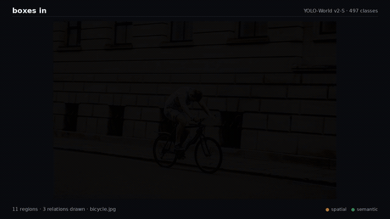
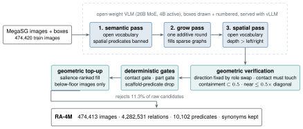

<div align="center">

# RelateAnything

**Real-time open-vocabulary relation prediction from any boxes or masks.**<br>
53 M parameters · 20 ms per frame on an A40 · no object labels · the predicate vocabulary is an input, not a weight.

[](https://maelic.github.io/Relate-Anything-Project)
[](https://huggingface.co/maelic)
[](https://huggingface.co/datasets/maelic/RA-4M)
[](https://maelic.github.io/RelateAnything_demo/)
[](https://github.com/Maelic/RelateAnything/actions/workflows/ci.yml)
[](pyproject.toml)
[](LICENSE)

[Project page](https://maelic.github.io/Relate-Anything-Project) ·
[Browser demo](https://maelic.github.io/RelateAnything_demo/) ·
[Models](https://huggingface.co/maelic) ·
[RA-4M](https://huggingface.co/datasets/maelic/RA-4M) ·
[OV-SGG-Bench](https://huggingface.co/datasets/maelic/OV-SGG-Bench) ·
[Docs](docs/)



</div>

---

Give the model an image and a set of regions, from any detector, any
segmenter, or ground truth. It returns ranked relations between pairs of them:

```python
from relsgg.api import RelateAnything

model = RelateAnything.from_checkpoint("model.pth", predicates=["riding", "holding", "next to"])
model.predict(image, boxes)                       # [Triplet(sub=3, "riding", obj=7, 0.91), ...]
model.set_vocabulary(["about to collide with", "reflected in"])   # any strings, no retraining
```

Three properties make that work, and they are the point of the project:

- **The predicate vocabulary is supplied at inference.** Any phrase is a valid
  predicate. Changing the vocabulary costs one pass of a small text encoder;
  inference afterwards is pure vision, with no language model in the loop, and
  the model cannot output a relation outside the list you gave it.
- **Object class labels are never an input.** Pixels and regions in, relations
  out. Swap the detector, or use a class-agnostic segmenter, without touching
  the relation model.
- **One forward pass, one or two graphs.** Ask for a single ranked list, or for a
  **spatial** graph and a **semantic** graph at once, since a pair can hold a
  layout relation and an interaction at the same time.

The model runs at 20 ms per frame end to end on an A40 and as one ONNX graph on a
laptop CPU or [in the browser](https://maelic.github.io/RelateAnything_demo/).

## Install

```bash
git clone https://github.com/Maelic/RelateAnything
cd RelateAnything
pip install -e ".[hub]"          # torch, transformers, huggingface_hub; Python 3.12+
```

Optional: `pip install -e ".[deploy]"` for ONNX Runtime and the laptop demo,
`".[dev]"` for the tests. Cluster and offline setups:
[docs/installation.md](docs/installation.md).

## Quickstart

```python
from huggingface_hub import snapshot_download
from relsgg.api import RelateAnything

d = snapshot_download("maelic/relsgg-vits16plus")          # model.pth + text encoder, 0.3 GB
model = RelateAnything.from_checkpoint(
    f"{d}/model.pth", predicates=["holding", "looking at", "leaning against"], device="cuda")

triplets = model.predict(image, boxes_xyxy, topk=20)      # image: PIL or HWC array; boxes: [N, 4] pixels
for t in triplets:
    print(t.subject_idx, t.predicate, t.object_idx, round(t.score, 3))

graphs = model.predict(image, boxes_xyxy, decompose=True)   # two graphs from the same pass
graphs["spatial"], graphs["semantic"]
```

Released checkpoints embed their backbone configuration, so nothing else is
downloaded and no gated login is needed. Box sources, score calibration,
thresholds and batching: [docs/quickstart.md](docs/quickstart.md).

## Models

Six checkpoints, one recipe; the backbone is the only variable. The three
released models train on RA-4M + raw Visual Genome + a 5 % share of HICO-DET;
the `-zeroshot` models use the same recipe with no HICO-DET, which is the
paper's zero-shot setting. Every number is generated from measured evaluation
files by [`release/make_model_cards.py`](release/make_model_cards.py).

| model | backbone | params | A40, batch 1 | img/s, batch 32 | OVS-F1 | OVS-mR |
|---|---|---|---|---|---|---|
| [`relsgg-vits16`](https://huggingface.co/maelic/relsgg-vits16) | DINOv3 ViT-S/16 | 44.7 M | 26.0 ms | 201 | 0.393 | 0.350 |
| [`relsgg-vits16plus`](https://huggingface.co/maelic/relsgg-vits16plus) ⭐ | DINOv3 ViT-S/16+ | 51.8 M | 26.8 ms | 188 | 0.411 | 0.369 |
| [`relsgg-vitb16`](https://huggingface.co/maelic/relsgg-vitb16) | DINOv3 ViT-B/16 | 112.3 M | 25.9 ms | 130 | 0.417 | 0.374 |
| [`relsgg-vits16-zeroshot`](https://huggingface.co/maelic/relsgg-vits16-zeroshot) | DINOv3 ViT-S/16 | 44.7 M | 26.0 ms | 201 | 0.376 | |
| [`relsgg-vits16plus-zeroshot`](https://huggingface.co/maelic/relsgg-vits16plus-zeroshot) | DINOv3 ViT-S/16+ | 51.8 M | 26.8 ms | 188 | 0.386 | |
| [`relsgg-vitb16-zeroshot`](https://huggingface.co/maelic/relsgg-vitb16-zeroshot) | DINOv3 ViT-B/16 | 112.3 M | 25.9 ms | 130 | 0.395 | |

⭐ `relsgg-vits16plus` is the recommended default: it reaches the score of the
ViT-B model at half the parameters. Parameter counts are those of the exported
graph (the paper's 53 M counts the training-time model). At batch size 1 the
family is dispatch-bound, so latency is flat across sizes; pick by throughput.
OVS is the composite of [OV-SGG-Bench](#ov-sgg-bench). Each model card lists
the full per-benchmark numbers, deployment thresholds, and provenance.

**Transfer on four test sets the model never trained on**
(`relsgg-vits16plus`, ground-truth boxes, graph-constrained):

| benchmark | R@50 | mR@50 | F1@50 |
|---|---|---|---|
| VG150 | 0.533 | 0.282 | 0.369 |
| PSG | 0.401 | 0.306 | 0.347 |
| IndoorVG | 0.527 | 0.295 | 0.378 |
| HICO-DET | 0.452 | 0.314 | 0.371 |

**Open vocabulary, no reparameterization**: all 19,103 training predicates stay
deployed and the model is never told the benchmark's label set; a prediction
counts when a synonym matcher accepts it at a calibrated threshold:

| benchmark | SoftR@50 | SoftmR@50 | SoftF1@50 |
|---|---|---|---|
| VG150 | 0.560 | 0.345 | 0.427 |
| PSG | 0.305 | 0.283 | 0.294 |
| IndoorVG | 0.533 | 0.346 | 0.419 |

## Why a new benchmark

Scene-graph benchmarks share their predicate vocabulary with the corpora models
train on. VG150's test split uses the same 50 predicate strings as its training
split, so a VG150-trained model faces no vocabulary novelty at all, and micro
recall tracks that overlap and nothing else. A counting baseline over
ground-truth object-category pairs, using no pixels, beats a trained model on
the most reported metric while losing to it by a wide margin per predicate.

| training corpus | distinct predicates | overlap with VG150 | with PSG | with IndoorVG |
|---|---|---|---|---|
| VG150 train (typical baseline) | 50 | **100.0 %** | 57.3 % | **95.7 %** |
| RA-4M (ours) | 9,848 | 49.1 % | 35.3 % | 45.4 % |

### OV-SGG-Bench

So this repository ships a protocol as well as a model. Six axes, chosen so
that no single one can be won by matching a benchmark's prior:

| axis | question | source |
|---|---|---|
| A1 transfer | generalises across annotation styles? | VG150, PSG, IndoorVG, HICO-DET, ground-truth boxes |
| A2 precision | hallucinates rare predicates? | Haystack and HICO-DET explicit negatives |
| A3 open vocabulary | means the right relation, without the label set? | synonym matcher at a calibrated threshold |
| A4 deployment | survives a real detector? | SGDet on a shared open-vocabulary detector |
| A5 graph quality | is the graph as a whole true and informative? | a vision-language judge, no ground truth in the prompt, scored per relation |
| A6 spatial | understands space, or co-occurrence? | SpatialSense adversarial true/false pairs |

The protocol: [`benchmark/SPEC.md`](benchmark/SPEC.md). The argument and the
traps in scene-graph metrics: [docs/evaluation.md](docs/evaluation.md). The
evaluation packs, negatives and calibration files:
[`maelic/OV-SGG-Bench`](https://huggingface.co/datasets/maelic/OV-SGG-Bench).

## RA-4M

The training corpus: **474,413 images, 4,282,531 relations, 10,102 distinct
free-text predicates**, generated by a vision-language model against drawn,
numbered boxes and filtered by a deterministic geometric check. Images are
MegaSG's ([JosephZ/mega_1m](https://huggingface.co/datasets/JosephZ/mega_1m))
and are referenced by identifier only; the annotations are ours. Synonyms are
never collapsed, since surface-form diversity is part of the label space.

Download: [`maelic/RA-4M`](https://huggingface.co/datasets/maelic/RA-4M).
Pipeline: [`datagen/`](datagen/). Format and packs: [docs/data.md](docs/data.md).

## Run the demo

**In your browser**, fully client-side (ONNX Runtime Web, WebGPU or WASM), no
install: **<https://maelic.github.io/RelateAnything_demo/>**.

**On your laptop**, CPU only, no torch: a detector, the relation head and the
decode with `numpy` and `onnxruntime`:

```bash
pip install -r deploy/dist/requirements.txt
python deploy/demo_webcam.py --dist deploy/dist/relsgg-vits16plus                    # webcam
python deploy/demo_webcam.py --dist deploy/dist/relsgg-vits16plus --image photo.jpg  # one image
python deploy/demo_webcam.py --dist deploy/dist/relsgg-vits16plus --decompose        # two graphs
```

The relation graph comes with the model repository. Detector weights are not
redistributed (AGPL upstream); [`deploy/README.md`](deploy/README.md) gives the
two-command local rebuild, and the ONNX and OpenVINO export recipe.

## How it works

<div align="center"></div>

A frozen-config DINOv3 backbone reads the image once. Each region becomes a
token from its box (or mask) geometry and pooled features; a pair sampler keeps
the pairs worth scoring; a relation transformer attends over pairs and patches;
and a vocabulary head scores each pair against a matrix of predicate
embeddings. That matrix is produced from your strings by a distilled text
encoder, so it can be replaced at any time. Module by module:
[docs/architecture.md](docs/architecture.md).

## Reproduce the paper

| what | where |
|---|---|
| train a released model | [`train.sh`](train.sh), the recipe in [docs/training.md](docs/training.md), the exact arguments in [`training/configs/`](training/configs/) |
| build the packs, the vocabulary, the text student | [`training/`](training/) |
| evaluate on the six axes, run the OvSGTR baseline through the same scorer | [`benchmark/`](benchmark/) |
| generate RA-4M | [`datagen/`](datagen/) |
| the appendix probes (attribution, counterfactuals, text space, priors) | [`research/`](research/) |
| latency, FLOPs and deployment cost tables | `deploy/bench_*.py`, `benchmark/latency.py`, `benchmark/model_cost.py` |

Before you trust a number, read [docs/pitfalls.md](docs/pitfalls.md): every
entry there has produced a plausible wrong result at least once.

## Repository map

| path | what |
|---|---|
| [`relsgg/`](relsgg/) | the model: backbone, geometry, pair sampler, relation transformer, vocabulary head, losses, scoring, checkpoint loading, the public API |
| [`data/`](data/) | pack loader, dataset mixtures, multi-scale sampling |
| [`train.py`](train.py), [`train.sh`](train.sh) | training entry point and the released recipe |
| [`training/`](training/) | pack builders, converters, vocabulary and soft-supervision builders, text-student distillation, released configs |
| [`benchmark/`](benchmark/) | OV-SGG-Bench: the specification, every scorer and entry point, the baseline adapter |
| [`deploy/`](deploy/) | ONNX and OpenVINO export, bundles, calibration, the laptop and Gradio demos, cost benchmarks |
| [`datagen/`](datagen/) | the RA-4M generation pipeline and its prompts |
| [`research/`](research/) | probes behind the paper's analysis sections |
| [`release/`](release/) | checkpoint stripping, model and dataset cards, Hugging Face upload |
| [`docs/`](docs/) | installation, quickstart, architecture, data, training, evaluation, deployment, pitfalls |
| [`tests/`](tests/) | CPU-only tests, run by CI on Python 3.12 and 3.13 |

## Documentation

| page | read it when |
|---|---|
| [Installation](docs/installation.md) | setting up, downloading weights and packs, running offline or on a cluster |
| [Quickstart](docs/quickstart.md) | you have a checkpoint and want triplets out of it |
| [Architecture](docs/architecture.md) | you want to know what happens between pixels and triplets |
| [Data](docs/data.md) | RA-4M, the pack format, mixtures, adding a source |
| [Training](docs/training.md) | reproducing a released model or running an ablation |
| [Evaluation](docs/evaluation.md) | reporting a number or comparing against another method |
| [Deployment](docs/deployment.md) | exporting to ONNX or OpenVINO, picking thresholds |
| [Pitfalls](docs/pitfalls.md) | before you trust a number |
| [Contributing](CONTRIBUTING.md) | opening a pull request |

## License

- **Code**: [Apache-2.0](LICENSE).
- **Weights**: derivatives of Meta DINOv3, distributed under the
  [DINOv3 license](https://ai.meta.com/resources/models-and-libraries/dinov3-license/).
- **RA-4M annotations**: generated by Gemma, distributed with the
  [Gemma Terms of Use](https://ai.google.dev/gemma/terms) notice. Images are not
  redistributed.
- **Demo detectors**: derive from ultralytics (AGPL-3.0) and are rebuilt locally,
  never shipped in a release artifact.

Every upstream credit and the exact terms: [THIRD_PARTY_NOTICES.md](THIRD_PARTY_NOTICES.md).

## Citation

```bibtex
@article{neau2026relateanything,
  title   = {RelateAnything: Real-Time Open-Vocabulary Relation Prediction From Any Inputs},
  author  = {Neau, Ma\"elic},
  journal = {arXiv preprint},
  year    = {2026}
}
```
