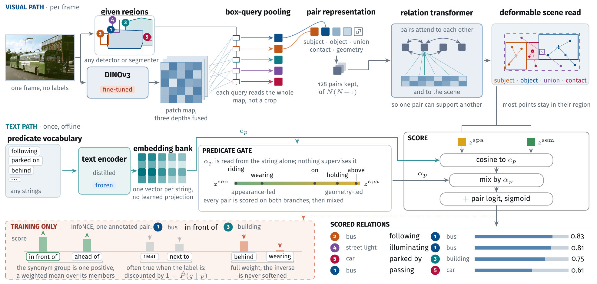

<div align="center">

# RelateAnything

**Real-time open-vocabulary relation prediction from any inputs.**

[](https://arxiv.org/abs/2609.12552)
[](https://huggingface.co/collections/maelic/relateanything)
[](https://maelic.github.io/RelateAnythingProject/demo/)
[](https://github.com/Maelic/RelateAnything/actions/workflows/ci.yml)
[](LICENSE)

[Paper](https://arxiv.org/abs/2609.12552) ·
[Project page](https://maelic.github.io/RelateAnythingProject) ·
[Models](https://huggingface.co/collections/maelic/relateanything) ·
[Training data](https://huggingface.co/datasets/maelic/RA-4M) ·
[Documentation](docs/)

</div>

Give RelateAnything **an image, object regions, and the relations you want to
look for**. It returns scored `(subject, relation, object)` triplets, such as
`person → riding → horse`.

- **Use your own regions.** Boxes can come from a detector, a segmenter, or a
  person. Masks are optional.
- **Choose the relation vocabulary.** Supply phrases at inference time without
  retraining. A small text encoder embeds them once; no language model runs
  per frame.
- **Get one graph or two.** Return a single ranked list, or separate spatial
  and semantic graphs from the same forward pass.

https://github.com/user-attachments/assets/76544f31-53ac-407b-9445-157e83946938

<p align="center"><sub>The same relation model across five scenes, with tracked regions and relations. <a href="assets/reel_video/credits.json">Clip credits</a> · <a href="deploy/README.md#8-the-video-reel-render_videopy">Reproduce the video</a></sub></p>

**[Try the browser demo](https://maelic.github.io/RelateAnythingProject/demo/)** —
no installation; inference runs on your device using WebGPU or WASM.

[Quickstart](#quickstart) · [Models](#models) · [Deployment](#deployment) ·
[Performance](#performance) · [Results](#results) · [How it works](#how-it-works)

## Quickstart

Use **Python 3.12+**. Install a CUDA-enabled PyTorch build for NVIDIA GPU
inference, or use `device="cpu"` in the example below.

```bash
git clone https://github.com/Maelic/RelateAnything.git
cd RelateAnything
pip install -e ".[hub]"
```

Run this from the repository root. The sample photo is included; the two
example boxes identify the person and the horse.

```python
import numpy as np
from PIL import Image
from relsgg import RelateAnything

model = RelateAnything.from_pretrained("maelic/relsgg-vits16plus", device="cuda")
image = Image.open("assets/reel/images/horse.jpg").convert("RGB")
boxes = np.array([[470, 130, 650, 630], [90, 310, 1010, 875]], dtype=np.float32)

# Boxes are [x1, y1, x2, y2] in original-image pixels.
# Labels are optional and only make the printed triplets easier to read.
for triplet in model.predict(image, boxes, box_labels=["person", "horse"], topk=5):
    print(triplet)

# Change what relations to look for, without retraining.
model.set_vocabulary(["riding", "carrying a rider", "beside", "in front of"])
graphs = model.predict(image, boxes, box_labels=["person", "horse"], decompose=True)
print(graphs["spatial"])
print(graphs["semantic"])
```

Released checkpoints include the backbone configuration and text encoder;
**no gated DINOv3 login is needed for inference**. Replace the sample image and
boxes with your own inputs; the API also supports masks and a larger built-in
relation vocabulary.

[API guide: inputs, vocabularies, masks, and scores](docs/quickstart.md) ·
[Installation and offline use](docs/installation.md)

## Models

Start with **`relsgg-vits16plus`**, the recommended balance of quality and speed.
All three checkpoints use the same training recipe; their vision backbones differ.

| Checkpoint | Backbone | Parameters |
|---|---|---:|
| [`relsgg-vits16`](https://huggingface.co/maelic/relsgg-vits16) | DINOv3 ViT-S/16 | 46.1 M |
| **[`relsgg-vits16plus`](https://huggingface.co/maelic/relsgg-vits16plus)** | **DINOv3 ViT-S/16+** | **53.2 M** |
| [`relsgg-vitb16`](https://huggingface.co/maelic/relsgg-vitb16) | DINOv3 ViT-B/16 | 113.8 M |

[Compare model quality and speed](docs/results.md#model-comparison).
Each model card includes evaluation results and calibration details.

## Deployment

- **PyTorch:** use the Python API above on CPU or CUDA.
- **NVIDIA GPU / TensorRT 10:** build a local FP32 engine from the released
  ONNX graph. Vocabulary selection, calibration and two-graph decoding stay
  available. [Setup and examples](deploy/README.md#tensorrt-nvidia-gpu).
- **Laptop / ONNX or OpenVINO:** run the local image or webcam demo.
  [Setup](deploy/README.md) · [OpenVINO](docs/deployment.md#laptop-cpu-openvino).
- **Browser:** [try the demo](https://maelic.github.io/RelateAnythingProject/demo/)
  without installing Python.

After downloading the relation graph and building the local detector as
explained in the [deployment guide](deploy/README.md):

```bash
# CPU image demo; omit --image to use a webcam.
python deploy/demo_webcam.py --dist deploy/dist/relsgg-vits16plus --image photo.jpg

# NVIDIA GPU, after building both TensorRT engines.
python deploy/demo_webcam.py --dist deploy/dist/relsgg-vits16plus \
  --backend tensorrt --device cuda --image photo.jpg --decompose
```

The relation model consumes regions; it does not detect objects itself.
Demo detectors are rebuilt locally and have separate licenses. The exported
ONNX/TensorRT graph scores boxes; native mask inputs are supported by the
PyTorch API. [Deployment contracts and limitations](docs/deployment.md).

## Performance

<!-- BEGIN GENERATED LATENCY -->
On an **RTX 3080 Laptop GPU**, the recommended
**ViT-S+** model takes **17.2 ms per image** with TensorRT FP32,
including preprocessing, transfers and triplet decoding. Object regions are provided as input.
<!-- END GENERATED LATENCY -->

<!-- BEGIN GENERATED E2E LATENCY -->
With **YOLO26m detection included**, the full pipeline takes **36.5 ms per image**.
Detection uses PyTorch FP32; ViT-S+ relations use TensorRT FP32.

*Warm median latency, batch 1, 35 relation types, 6 sample images; loading and setup excluded.*

[All models and runtimes](docs/benchmarks/README.md) ·
[YOLO26, YOLO-World and YOLOE comparison](docs/benchmarks/end-to-end.md) ·
[Paper pipeline benchmarks](docs/deployment.md#realtime-pipeline)
<!-- END GENERATED E2E LATENCY -->

## Results

The paper evaluates relation prediction across datasets, open vocabularies and
spatial reasoning tasks. Selected transfer results for **ViT-S+**, using
ground-truth boxes and one relation per ordered pair:

| Test set | OvSGTR F1@50 | RelateAnything F1@50 |
|---|---:|---:|
| VG150 | 16.5 | **36.9** |
| PSG | 13.5 | **34.7** |
| IndoorVG | 20.2 | **37.8** |

Both models use the same evaluator and vocabulary. OvSGTR receives object
labels; RelateAnything does not. The [full results](docs/results.md) cover
stronger baselines including ROBIN-3B, zero-shot controls and the complete evaluation.

[Evaluation protocol](benchmark/SPEC.md) · [Scoring guide](docs/evaluation.md)

## How it works

<a href="assets/architecture.png"></a>

*Figure 2 from the [paper](https://arxiv.org/abs/2609.12552). Click to enlarge.*

A DINOv3 backbone reads the image once. Regions become visual tokens; a pair
sampler selects candidate relations; a transformer refines them using the
scene. A vocabulary head scores each pair against embeddings of your predicate
strings, mixing spatial and semantic features. Swapping that embedding bank
changes the vocabulary without retraining the vision model.

[Architecture guide](docs/architecture.md)

## Data and evaluation packs

- **[RA-4M](https://huggingface.co/datasets/maelic/RA-4M):** training annotations
  for open-vocabulary relations. Images are referenced by ID and are not
  redistributed. [Dataset details and generation](docs/data.md).
- **[OV-SGG-Bench](https://huggingface.co/datasets/maelic/OV-SGG-Bench):** evaluation
  packs, explicit negatives and calibration files for six complementary axes.
  [Protocol](benchmark/SPEC.md).

## Reproduce and contribute

- **Train:** [training guide](docs/training.md), [released configs](training/configs/)
  and [`train.sh`](train.sh).
- **Evaluate:** [evaluation guide](docs/evaluation.md) and [`benchmark/`](benchmark/).
- **Generate annotations:** [`datagen/`](datagen/). **Explore the paper's probes:**
  [`research/`](research/).
- **Contribute:** [contributor guide](CONTRIBUTING.md). Bug reports, deployment
  feedback and examples of new uses are welcome in
  [GitHub issues](https://github.com/Maelic/RelateAnything/issues). Include the
  model, runtime, hardware and a small reproducer when reporting a problem.

The [documentation index](docs/) covers the API, architecture, training, data
and deployment. Read [evaluation pitfalls](docs/pitfalls.md) before comparing
results or changing the scoring path.

## License

- **Code:** [Apache-2.0](LICENSE).
- **Model weights:** derivatives of Meta DINOv3; see the model cards and
  [DINOv3 license](https://ai.meta.com/resources/models-and-libraries/dinov3-license/).
- **RA-4M annotations:** carry the [Gemma Terms of Use](https://ai.google.dev/gemma/terms)
  notice. Source images are not redistributed.
- **Demo detectors:** ultralytics-derived components use AGPL-3.0 and are
  excluded from the relation model's release artifacts.

[Full third-party notices and credits](THIRD_PARTY_NOTICES.md)

## Citation

```bibtex
@article{neau2026relateanything,
  title   = {RelateAnything: Real-Time Open-Vocabulary Relation Prediction From Any Inputs},
  author  = {Neau, Ma\"elic},
  journal = {arXiv preprint arXiv:2609.12552},
  eprint  = {2609.12552},
  archivePrefix = {arXiv},
  primaryClass  = {cs.CV},
  url     = {https://arxiv.org/abs/2609.12552},
  year    = {2026}
}
```
